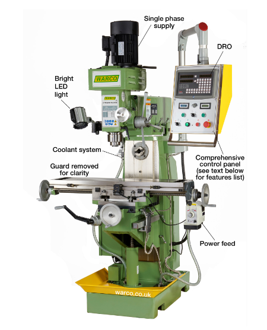

# Milling Machine Predictive Maintenance Project

## Project Overview
In the industrial sector, preventive maintenance is essential for maximizing operational efficiency and minimizing costly downtime. This project addresses the implementation of artificial intelligence for predictive maintenance, focusing on milling machines. The primary objective is to develop a predictive model capable of forecasting milling machine failures, thereby reducing downtime and maintenance costs. Additionally, the model assesses failure probability under varying processing conditions and equipment quality levels, helping enhance machine reliability and operation profitability.

  

## Dataset
The dataset used for this project contains 10,000 entries and 14 features. Key attributes include:
- Product ID and quality (low, medium, high),
- Air temperature and process temperature,
- Rotational speed and torque,
- Tool wear time,
- Machine failure indicators.

Five distinct failure modes are identified, including tool wear, heat dissipation issues, power failures, overload, and random failures. The dataset was preprocessed for imbalanced data, as failure occurrences were significantly lower than non-failure instances.

## Data Analysis & Preprocessing
Exploratory data analysis revealed a need for data rebalancing and feature engineering. Notable preprocessing steps include:
1. **Feature Addition**: A new feature, "Power," was derived by multiplying rotational speed and torque, representing the work done by the machine.
2. **Standardization and Normalization**: Feature scaling ensured consistent data ranges for model compatibility.
3. **Data Cleaning**: Missing values were addressed, and low-variance features were removed to reduce noise.
4. **Dimensionality Reduction**: Techniques like PCA (Principal Component Analysis) helped improve model efficiency and highlight key features influencing machine performance.

## Models
Various models were tested to identify the best predictive approach:
1. **Decision Tree**: Provided an interpretable model, though prone to overfitting without depth restriction.
2. **Logistic Regression**: Efficient for binary classification but limited in capturing complex patterns.
3. **Random Forest**: Achieved robust accuracy by handling nonlinear relationships and minimizing overfitting.
4. **Support Vector Machine (SVM)**: Optimal with RBF kernel, yielding high discrimination for classes in multidimensional space.
5. **Neural Networks (MLPClassifier and TensorFlow)**: The TensorFlow-based neural network achieved the best results, capturing intricate patterns and nonlinearity in the data.

Performance metrics like accuracy, F1-score, ROC AUC, and Matthews correlation coefficient were used to evaluate models, with the TensorFlow model performing optimally.

## Deployment
The best-performing model was deployed using a Flask web application accessible at http://172.22.5.120:5000. The following components were integrated:
1. **Data Normalization**: Ensures that incoming data matches the model’s trained scale.
2. **Model Loading and Prediction**: Pre-trained weights are loaded for real-time prediction of machine status as "Functional" or "Failure."
3. **Docker**: The application was containerized with Docker, making it easily deployable across various environments.
4. **Web Interface**: Users can interact with the model via a user-friendly webpage, submitting data for real-time failure predictions.

## Conclusion
This project demonstrates the feasibility of using AI to improve maintenance practices in an industrial setting. By identifying potential failures in advance, the model provides valuable insights for predictive maintenance, reducing downtime and associated costs.
